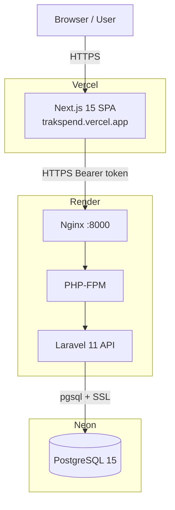
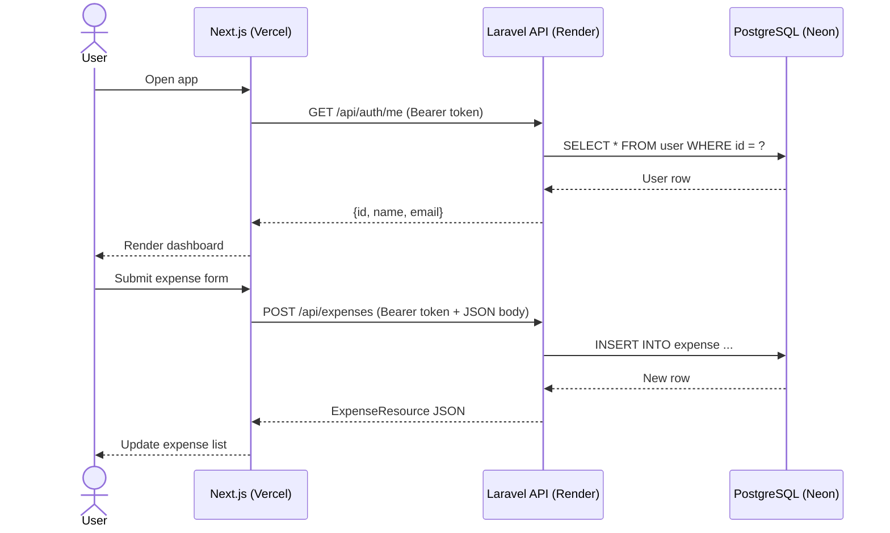
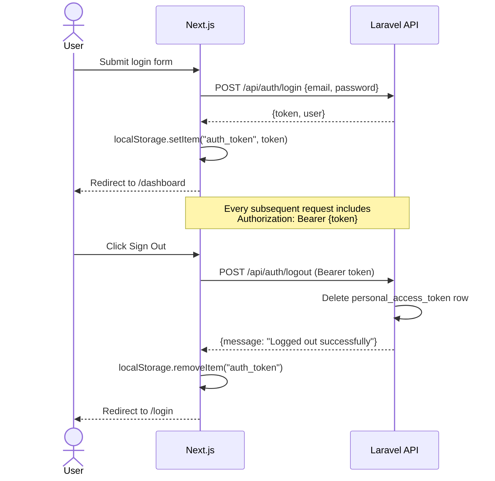
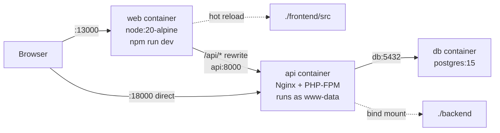

# Architecture

## System Architecture



---

## Request Flow



---

## Authentication Flow



---

## Database Schema

```
user
├── id (bigserial PK)
├── name (varchar)
├── email (varchar, unique)
├── password (varchar, bcrypt)
├── remember_token
├── email_verified_at
├── created_at
└── updated_at

category
├── id (bigserial PK)
├── name (varchar)
├── slug (varchar, unique)
├── icon (varchar)  — Material Symbols name
├── color (varchar) — hex color
├── created_at
└── updated_at

expense
├── id (bigserial PK)
├── user_id (FK → user.id, CASCADE DELETE)
├── category_id (FK → category.id)
├── amount (decimal 10,2)
├── description (text, nullable)
├── spent_at (timestamp)
├── created_at
└── updated_at

personal_access_tokens  (Sanctum)
├── id
├── tokenable_type
├── tokenable_id
├── name
├── token (sha256 hash)
├── abilities
├── last_used_at
├── expires_at
└── created_at / updated_at
```

---

## Frontend Structure

```
frontend/src/
├── app/
│   ├── layout.tsx          # Root layout — wraps everything in <AuthProvider>
│   ├── page.tsx            # / → redirects to /dashboard or /login
│   ├── login/page.tsx      # Login form
│   ├── register/page.tsx   # Registration form
│   └── dashboard/page.tsx  # Main app page
├── components/
│   ├── ExpenseForm.tsx     # Add expense form (fetches categories)
│   └── ExpenseList.tsx     # Expense table/list
├── hooks/
│   ├── useAuth.tsx         # AuthContext + AuthProvider
│   └── useAllExpenses.ts   # Expense CRUD state (full list, filtered client-side)
└── lib/
    ├── api.ts              # fetch wrapper (relative URLs; the rewrite routes them)
    └── types.ts            # Shared TypeScript interfaces
```

---

## API Routes

| Method | Path | Auth | Handler |
|--------|------|------|---------|
| GET | `/api/health` | Public | inline closure |
| GET | `/api/categories` | Public | CategoryController@index |
| POST | `/api/auth/register` | Public | AuthController@register |
| POST | `/api/auth/login` | Public | AuthController@login |
| POST | `/api/auth/logout` | Sanctum | AuthController@logout |
| GET | `/api/auth/me` | Sanctum | AuthController@me |
| GET | `/api/expenses` | Sanctum | ExpenseController@index |
| POST | `/api/expenses` | Sanctum | ExpenseController@store |

---

## Local Dev Architecture



Host ports (`13000`/`18000`/`15432`) are deliberately off the defaults and are
configurable via `WEB_HOST_PORT`, `API_HOST_PORT` and `DB_HOST_PORT`.
Container-internal ports never change. In normal use the browser only talks to
`:13000` — the `/api/*` rewrite proxies to the API, so no cross-origin request is
ever made.
